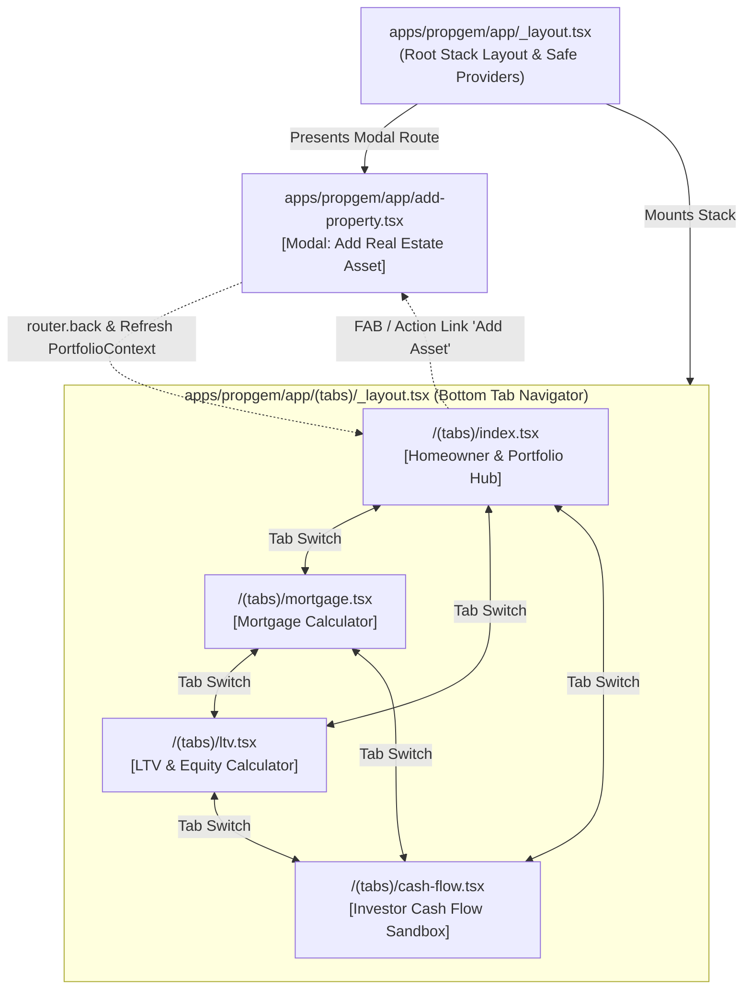

<!--
  AUTOMATED UX PROTOCOL: Whenever modifying, creating, or refactoring screens in apps/propgem/app/, the agent MUST re-evaluate the target screen's Cognitive Load Rating against our heuristics, update this context document, and flag any screen that exceeds a Rating of 3.
-->

# PropGem: UI Navigation & Cognitive Load Context

## 1. System Architecture & UX Protocol

> [!IMPORTANT]
> **AUTOMATED UX PROTOCOL**
> Whenever modifying, creating, or refactoring screens in `apps/propgem/app/`, the agent **MUST** re-evaluate the target screen's Cognitive Load Rating against our heuristics, update this context document, and flag any screen that exceeds a Rating of 3.

---

## 2. Navigation Flow Graph

---

## 3. Cognitive Load & Density Heuristics

To deliver a high-performance, clutter-free mobile experience, all PropGem screens must adhere to the following four design heuristics:

### Heuristic 1: Input Density Limit (Maximum 6 Inputs)
* **Rule**: A maximum of **6 primary input fields / sliders** may be rendered simultaneously on screen before requiring progressive disclosure (e.g., accordions, segmented sub-views, or collapsible cards).
* **Rationale**: Excessive simultaneous inputs induce cognitive friction, fatigue, and form abandonment on mobile form factors.

### Heuristic 2: Visual Hierarchy & KPI Threshold
* **Rule**: Every screen must feature **1 clear Primary KPI / Action Hero** (e.g., Total Monthly Payment, Net Monthly Cash Flow, or LTV %) and no more than **3 Secondary metrics** visible above the fold.
* **Rationale**: Prevents "dashboard overload" and ensures the user can immediately parse the core outcome of their financial simulation.

### Heuristic 3: Scroll Depth & Task Focus
* **Rule**: A single screen must focus on a single core user task. Distinct workflows (e.g., raw scenario simulation vs. multi-property portfolio management, or monthly payments vs. 30-year multi-row amortization tables) must be segregated via progressive disclosure, tabs, or dedicated sub-views.
* **Rationale**: Long scrolling views with mixed concerns dilute user focus and create disorientation when modifying interdependent parameters.

### Heuristic 4: Cognitive Load Rating Scale (1 to 5)

| Rating | Classification | State & Architectural Implication |
| :--- | :--- | :--- |
| **1 - 2** | **Optimal / Minimalist** | Clean visual hierarchy, focused single-task flow, <= 4 inputs. |
| **3** | **Balanced / Information-Dense** | Structured information density, progressive disclosure in place, <= 6 active inputs per group. Target standard for complex financial calculators. |
| **4 - 5** | **Overloaded (Needs Refactoring)** | > 6 visible inputs without progressive disclosure, competing visual KPIs, or multi-task collision on a single screen. Requires restructuring. |

---

## 4. Screen-by-Screen Inventory & Assessment Matrix

| Route Path | Primary Objective | Key Components & Inputs Count | Cognitive Load Rating (1-5) | UX Assessment & Recommendations | Safe Area / Inset Status |
| :--- | :--- | :--- | :---: | :--- | :--- |
| **`app/_layout.tsx`** | Global Root Navigation & Context Provider | • `SafeAreaProvider` • `PortfolioProvider` • Native Stack Navigator | **1** | Clean container setup. Disables default headers for tabs and applies dark `#09090B` theme styling. | ✅ Compliant (Provides root safe insets context) |
| **`app/(tabs)/_layout.tsx`** | Bottom Tab Navigation Bar | • 4 Bottom Tabs • Custom Icons (`Ionicons`) • Haptic feedback on tap | **2** | Optimal tab density (4 items). Clear visual indicators for active vs inactive tabs (`#38BDF8` active). | ✅ Compliant (`useSafeInsets` dynamic padding for Android 3-button & iOS home bar) |
| **`app/(tabs)/index.tsx`** | Homeowner Mortgage Simulation & Portfolio Asset Hub | • `PortfolioKpiSummary` (3 KPIs) • Hero Payment Card (1 KPI + 2 sub) • `PmiIndicator` • `StackedOutflowBar` • **4 Primary Core Sliders** • Progressive Disclosure: `CollapsibleSection` (Escrows/HOA) • Asset Filter Pills + `PropertyCard`s | **2** *(Optimal)* | ✅ **Phase 2 Refactored**: Segregated simulation from portfolio asset management. Core inputs reduced to 4 primary controls. Taxes, insurance, and HOA dues encapsulated in a collapsible accordion with live badge summary (`$XXX/mo`). Touch targets >= 44x44 dp with haptics. | ✅ Compliant (`screenBottomPadding` applied to ScrollView) |
| **`app/(tabs)/mortgage.tsx`** | Standalone Mortgage Outflow & Escrow Calculator | • Hero Payment Card (1 KPI + 2 sub) • `PmiIndicator` • `StackedOutflowBar` • **4 Primary Core Sliders** • Progressive Disclosure: Taxes/HOA Escrows • Progressive Disclosure: 12-Month Amortization Schedule | **2** *(Optimal)* | ✅ **Phase 2 Refactored**: 4 visible core loan drivers. Escrow fees and 12-month amortization breakdown neatly tucked into collapsible accordions. Clean 1-hero KPI display. Touch targets >= 44x44 dp with haptics. | ✅ Compliant (`screenBottomPadding` applied to ScrollView) |
| **`app/(tabs)/ltv.tsx`** | Loan-to-Value & Homeowner Equity Calculator | • Hero LTV Card with PMI Badge • `PmiIndicator` • Equity Breakdown Table • **2 Sliders** + 4 Preset Chips | **2** *(Optimal)* | ✅ **Minimalist & Highly Focused**: Single-purpose screen with immediate visual feedback. 4 preset chips enable 1-tap target LTV modeling. Gold standard for calculation speed. | ✅ Compliant (`screenBottomPadding` applied to ScrollView) |
| **`app/(tabs)/cash-flow.tsx`** | Real Estate Investor Cash Flow & Return Engine | • `PortfolioKpiSummary` • Hero Cash Flow Card (1 Primary KPI) • 3-Pillar Return Grid (Cap Rate, CoC, NOI) • **4 Primary Deal Drivers** • Progressive Disclosure: Operating Expenses & Reserves • Progressive Disclosure: Itemized Operating Statement | **2** *(Optimal)* | ✅ **Phase 2 Refactored**: Clutter eliminated. Reduced visible inputs from 10 to 4 core drivers (Rent, Price, Invested, Debt Service). Secondary operating costs (Tax, Ins, HOA, Reserves, Mgmt) and detailed financial statement encapsulated in collapsible sections with live preview badges. | ✅ Compliant (`screenBottomPadding` applied to ScrollView) |
| **`app/add-property.tsx`** | Data Entry Form to Add Property Asset | • Identity Card (2 inputs + type toggle) • Valuation Card (3 inputs) • Income Card (4 inputs, conditional) • Sticky Action Button • **9-11 Inputs Total** | **2** *(Optimal)* | ✅ **Structured Form Architecture**: Inputs grouped logically into discrete stepped cards. Rental-specific inputs conditionally hidden. Touch targets upgraded to >= 46dp for inputs and selector buttons. Sticky button padded with `modalFooterPadding`. | ✅ Compliant (`modalFooterPadding` applied to ScrollView) |

---

## 5. Safe Area & Soft-Key Inset Verification

PropGem uses a centralized inset resolution hook: [`apps/propgem/src/hooks/useSafeInsets.ts`](file:///Users/pcm/workspace/cqs-gems/apps/propgem/src/hooks/useSafeInsets.ts).

### Verification Checklist:
1. **Android Soft Navigation (3-Button Bar & Gesture Insets)**:
   - Evaluates `insets.bottom > 0` to distinguish between Android hardware soft keys (typically 24-48px) and gesture navigation pills.
   - `tabBarHeight` dynamically scales (`58 + tabBarPaddingBottom`) to prevent tab icons and labels from clipping into Android system navigation bars.
2. **iOS Home Indicator Bar**:
   - Applies `Math.max(insets.bottom, 16)` padding to tab bars and modal action buttons to prevent accidental gesture triggering.
3. **Scroll View Clearance (`screenBottomPadding`)**:
   - Every scrollable screen in `app/(tabs)/` applies `contentContainerStyle={{ paddingBottom: screenBottomPadding }}` (`tabBarHeight + 24`), ensuring bottom cards and CTA buttons scroll completely clear of the floating tab bar.
4. **Modal Footer Clearance (`modalFooterPadding`)**:
   - `app/add-property.tsx` applies `modalFooterPadding` to guarantee the sticky "Save Asset" button remains accessible above home gesture bars across all screen sizes.
